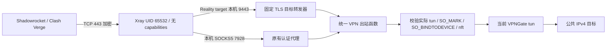

# public-vpn-node V1.1

V1.1 在 V1.0 VPNGate、动态 tun、策略路由和 Kill Switch 上增加多用户 **VLESS + Reality + TCP / XTLS Vision** 公网入口。iPhone Shadowrocket 和使用 Mihomo 内核的 Clash Verge 可导入独立用户配置。根据发布负责人提供的真实环境验收结果，VLESS + Reality 公网 TCP 443、多用户 add/disable/enable/delete、VPNGate Kill Switch、VPN 断线 fail-closed、自动重连换节点、Docker 服务重启恢复及端口边界均已通过。本次发布收尾仅执行离线验证，不重复运行验收；宿主整机重启、Mihomo 等未明确提供的结果不扩大认定。历史报告与 After-Snapshot 仅代表 V1.0，不能作为本版发布证据。

## 架构与边界



- 公网只新增 **TCP 443**，映射容器 8443；不开放 UDP；V1.1 当前只支持 TCP ingress，客户端 UDP forwarding 必须关闭。8787、7928 仍仅宿主 `127.0.0.1`，管理使用 SSH Tunnel。9443 只监听容器回环。
- 原有管理后台、HTTP/CONNECT、SOCKS5 CONNECT、VPNGate 获取/筛选/切换/自动重连保留。仅支持公共 IPv4 TCP 业务；UDP、IPv6、私网访问关闭。视频 QUIC 应回退 TCP；游戏、语音等 UDP 功能可能不可用。
- Xray 唯一业务出站是现有 SOCKS5；无 freedom/DIRECT、内置 DNS、API、订阅服务。Reality 伪装连接也经 VPN。业务 DNS 在代理中经标记并绑定 tun 的 UDP 查询完成。
- 每个用户有独立 UUID、独立 short ID，可新增、禁用、重新启用、删除。Reality 密钥对是服务器级材料，不是多人共用的 VLESS 用户凭据；Xray 不将 short ID 与 UUID 绑定，用户身份隔离以独立 UUID 为准。
- 新增独立 nft `inet public_vpn_ingress`：约束 Xray UID 65532，只允许本机 7928/9443 和 8443 入站连接的 established **reply**。其余 IPv4/IPv6 TCP/UDP 均丢弃，不用宽泛的 established 放行。规则不匹配 OpenVPN root 控制进程。
- 原有 `inet public_vpn_node` 继续检查 mark `0x56504e` 的 output/postrouting；table 100 指向当前实际 tun。连接前验证 tun 身份、路由及两套防火墙，失效不建连；监视器撤销已有 socket。节点切换重新绑定新 tun，客户端地址与凭据不变，旧连接需由应用重试。
- 不信任 health healthy 作为安全结论。必须完成 [V1.1 部署、客户端与故障验收](docs/V1.1部署与验收.md)。

## 为什么采用 Reality

复用现有 SOCKS5 可保留已经实现的 tun 绑定和动态切换逻辑；Reality 满足公网加密及客户端兼容需求，无需增加证书自动续期入口。没有采用 UDP 传输协议，因为 V1.0 SOCKS5 未实现 UDP ASSOCIATE。选用标准 TCP/Vision，不引入较新的传输扩展。

Reality 对认证失败的连接会连接固定伪装目标，因此本版不允许它直接访问公网，专门经本机转发器送入 VPN；VPN 不可用时握手也可能失败。这是有意的 fail-closed 行为。配置依据：[Xray Reality](https://xtls.github.io/en/config/transports/reality.html)、[Mihomo VLESS](https://wiki.metacubex.one/config/proxies/vless/)。Reality target/SNI 必须在部署时显式配置，并先做 TLS 1.3 兼容性验证；`REALITY_TARGET` 必须与 `secrets/ingress.json` 中 ingress state 的 `sni` 一致。`www.apple.com` 是本次经真实 Shadowrocket 验证可用的示例，不是默认值或永久兼容保证。此前 Microsoft target 在当前 Xray 26.3.27 + REALITY 实现中出现 TLS record length 超过 8192 的兼容问题；不能据此认定 Microsoft 普遍不兼容。

## 快速导航

- [部署、Shadowrocket/Clash 导入、用户管理、人工验收](docs/V1.1部署与验收.md)
- `compose.yaml`：保留 V1.0 部署；`compose.v1.1.yaml`：显式叠加公网入口，不能单独运行。
- `examples/ingress.example.json`：只有占位符的状态格式；不是可运行配置。
- `scripts/ingress_users.py`：管理员本地生成密钥/用户和导出文件；不会运行 Docker 或联网。
- `secrets/`：0700，用户数据库及导出 0600；`runtime/ingress/`：只读挂载给 Xray 的 0750/0640 配置，专用 GID 65532。真实材料全部排除 Git、构建与发布。
- `app/ingress.py`、`app/ingress_guard.py`：固定目标转发及独立内核限制。
- `scripts/verify.sh`：仅公开文件与模拟数据的离线验证，不读取 reference、真实凭据或运行数据。

```bash
bash scripts/verify.sh
```

本次开发仅在项目内修改和测试，未部署、未提权、未修改宿主防火墙、未重启服务或 Git commit/push。需要权限的动作只列于人工清单。当前交付目录没有 Git 仓库，不能报告 Git diff/暂存扫描已通过；公开文件扫描不能证明不存在任何未知格式秘密。

## 运维和风险

容器 VPN 仍以 root 加 NET_ADMIN/NET_RAW 运行，Xray 使用 UID 65532、cap_drop ALL、只读根文件系统、无 Docker socket。两者共享网络命名空间，不共享 PID/文件系统。管理员、Docker daemon、VPN 容器 root 与宿主内核属于信任边界；不能抵御管理员删除规则、恶意修改镜像或 VPN 控制面被攻陷。

VPNGate 控制面 API、测速和 OpenVPN 外层连接仍可从 eth0 引导连接；这些不等于业务泄漏。公网加密入口不会使不可信 VPNGate 成为可信出口，业务仍须端到端 HTTPS。没有逐用户限速/配额、设备绑定或完备 DoS 防护，持有某用户完整导出的人可冒用该用户；撤销并重新创建可换凭据。

Docker 自动恢复依赖宿主已有 Docker 自启动；`unless-stopped` 不恢复人为 stop 的容器。新版本依赖镜像、Linux nft/conntrack、Reality 目标及客户端组合必须现场验证，不能将离线 mock 视作内核防泄漏证明。

固定上游来源：`woyaozuofeiji/vpngate-docker` commit `14b803685e67b7d50deff8ee768d042d96dcaab1`。保留 GPL-3.0-or-later 和 [许可证材料](licenses/NOTICE.txt)。本次不读取或修改 `reference/`。

V1.1 / Shadowrocket 2.2.92 固定 **Xray 26.3.27 正式版**。镜像锁定与降级风险见
[兼容版本审计](docs/Xray兼容版本审计.md)。root 已核验版本 26.3.27、平台 linux/amd64；Compose 与锁文件固定为
`ghcr.io/xtls/xray-core@sha256:592ec4d11f656db95598d01e76dbcc6e002d67360b96a5436500a938230f52c7`；
`XRAY_IMAGE` 不再生效。恢复部署前必须通过 `python3 scripts/check_xray_pin.py`，
离线 verify 通过不等于真机兼容或部署就绪。本次不部署、不改变现有秘密与网络隔离。

新服务器恢复不能只复制仓库：`secrets/ingress.json` 不进入 Git，需重新 init/add/render 或从独立安全备份恢复，详见 [恢复说明](docs/V1.1部署与验收.md#8-新服务器恢复)。
