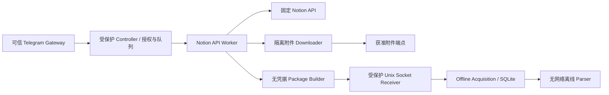

# Phase 2 Step 2C-B Step 2 Design

> Source: reviewed design Task `20261002-113541-1F50C3`
>
> This document is the canonical project copy of that Task's design result.
> No credentials or Notion tokens are included.

结论：**GO：继续细化设计并准备离线实现；NO-GO：当前代码直接接入生产 Notion。** 2C-A 与 2C-B Step 1 已提供可复用的封存、预算、fencing 和流式接收基础，但可信身份、scope 授权、网络边界、真实 socket 生命周期和受保护部署尚未实现。

本次仅审查项目代码及公开 API 文档；未修改文件、未部署、未访问真实 Notion 内容或凭据。以下目录、组件和配置均为建议，不代表已经创建。

**1．现有代码审查结论**

| 项目 | 当前实现与生产影响 |
|---|---|
| Telegram 身份 | [application.py](/ops/apps/tg-testcase-generator/src/tg_testcase/application.py:69) 检查 private chat、用户白名单及 owner，但 `actor` 来自调用方。只有入口本身可信，这些检查才构成授权。 |
| 引用解析 | [protocol.py](/ops/apps/tg-testcase-generator/src/tg_testcase/protocol.py:67) 先删除所有连字符再检查 ID，会接受非标准连字符布局；[reference_id](/ops/apps/tg-testcase-generator/src/tg_testcase/notion_package.py:80) 是规范化辅助函数，不能作为安全解析器。 |
| Receiver | [receiver.py](/ops/apps/tg-testcase-generator/src/tg_testcase/receiver.py:83) 校验 HELLO、可信 job、claim、package 和 artifact，错误不回显输入；但没有 socket 身份、deadline、并发限制或可信 job registry。 |
| COMMIT/EOF | [receiver.py](/ops/apps/tg-testcase-generator/src/tg_testcase/receiver.py:127) 在 COMMIT 后执行 `reader.read(1)`，读到 EOF 才进入最终封存。真实 socket 必须显式处理半关闭。 |
| 封存 | [acquisition.py](/ops/apps/tg-testcase-generator/src/tg_testcase/acquisition.py:100) 网络输入阶段不持 SQLite 写事务；完成 staging 后重新检查 claim、取消、revision、预算，原子发布。适合保留。 |
| staging 配置 | `seal_stream(..., staging=...)` 支持指定 staging，但当前 `receive()` 内部新建 importer，并未传递独立 staging 配置，默认使用 `store.root`。生产服务需要明确注入。 |
| Python 3.10 | [streaming.py](/ops/apps/tg-testcase-generator/src/tg_testcase/streaming.py:47) 无 `blobopen` 时整块读取一个附件再绑定 SQLite；最大为单附件 10 MiB，但存在复制和 SQLite 原生内存开销。 |
| 路径布局 | [store.py](/ops/apps/tg-testcase-generator/src/tg_testcase/store.py:18) 与 [storage.py](/ops/apps/tg-testcase-generator/src/tg_testcase/storage.py:8) 将状态路径限制在代码推导的 `PROJECT` 内。独立生产状态目录不能只靠改配置实现。 |
| 测试覆盖 | 当前 receiver 测试主要使用 `BytesIO`；`blobopen` 增量分支有模拟对象测试，不能替代真实 Unix socket 或 Python 3.11+ SQLite 集成验收。 |

还有一项适配风险：Notion property ID 不一定是 UUID，可能包含现有 `identifier()` 不接受的字符。未来 adapter 必须设计稳定、无碰撞的安全 locator 映射，不能把原始 property ID 直接塞进现有字段。

**2．建议组件与信任边界**

建议链路：



runner/Codex 不在上述可信控制链内，也不能调用带凭据的通用 fetch 接口。

| 建议组件 | 责任 |
|---|---|
| `telegram_identity` | 从可信 Telegram 更新建立身份、去重、防重放 |
| `authorization` / `scope_policy` | 用户、workspace、credential、root 和操作授权 |
| `job_registry` / `scheduler` | 持久 job、队列、租约、fencing、取消和恢复 |
| `notion_reference` | 严格 URL/ID 解析，不联网解析用户 URL |
| `notion_api_client` | 固定 endpoint/version、typed methods、分页、重试、响应预算 |
| `scope_walker` | 验证结构边、遍历树、生成缺口 |
| `attachment_downloader` | 无 Notion Token 的隔离下载 |
| `package_builder` / `framed_sender` | 生成 v1 package、落盘、hash、分块发送 |
| `receiver_service` | socket 认证、job 查找、deadline、调用现有 receiver |
| `reconciler` / `audit` | 崩溃恢复、staging 清理、结构化脱敏日志 |

控制接口只接收有类型的操作，例如 `enqueue_source`、`cancel_job`、`get_job_status`；不得接受任意 URL、header、文件路径、SQL 或 Python 方法名。

**3．可信身份与 scope policy**

Gateway 必须直接拥有可信 Telegram 接入，或通过专用受保护 IPC 接收经过认证的更新。消息正文、转发署名、username、用户提交 JSON 中的 `user_id` 均不能建立身份。

由 Gateway 建立：

```text
auth_context:
  issuer
  bot_instance
  telegram_user_id
  chat_id
  chat_type
  update_id
  issued_at
  expires_at
  nonce
```

Controller 验证 IPC peer、issuer、有效期、update 去重、private chat、用户授权、task owner、操作和 revision。若跨进程传递签名上下文，还应绑定 audience 和请求摘要；密钥不得进入 runner。

映射顺序必须固定：

```text
可信 auth_context
→ principal policy
→ 获准 workspace
→ 获准 root + root_type
→ credential_ref
→ 仅 API Worker 内解析为 Token
```

用户输入不能指定 `credential_ref`。多个 workspace/root 匹配产生歧义时拒绝，不能逐个 Token 尝试。

建议 scope policy 数据结构如下；值均为示意：

```yaml
schema_version: 1
policy_version: scope-2
policy_epoch: 1
default_effect: deny

principals:
  telegram:<numeric-user-id>:
    operations: [append_notion_reference, acquire, refresh, cancel]
    grants: [grant-a]

grants:
  grant-a:
    workspace_ref: workspace-a
    credential_ref: notion-read-a
    roots:
      - type: page
        id: <canonical-32hex-id>
        descendants: structural
      - type: database
        id: <canonical-32hex-id>
        data_sources:
          mode: explicit
          ids: [<canonical-32hex-id>]
      - type: data_source
        id: <canonical-32hex-id>
        expected_database_id: <canonical-32hex-id>
    relations: deny_follow
    synced_references: deny_follow
    links: deny_follow
    external_attachments: deny
    limits_profile: notion-standard

credentials:
  notion-read-a:
    workspace_ref: workspace-a
    secret_handle: notion-read-a
    generation: 1
    enabled: true
```

配置还需严格 schema、重复键拒绝、未知字段拒绝、启动验证及原子发布。policy digest、epoch、credential generation 进入受保护 job registry，不进入用户可控制的授权声明。

workspace 绑定来自管理员登记及受保护验证记录；不能假设每个 page response 都带可独立验证的 workspace ID。Token 可访问某个资源，也不代表当前 Telegram 用户获准读取该资源。

授权在入队、执行和提交时复核。policy 撤销必须使未提交 job 失效，不能继续沿用旧 grant；提交授权与本地撤销更新需要明确的事务顺序。

**4．严格解析与根范围校验**

建议首版沿用当前较窄输入范围：

- ID 仅接受 32 位十六进制，或标准 `8-4-4-4-12` UUID；统一为小写 32 hex。
- URL 仅接受 `https://notion.so/...`、`https://www.notion.so/...` 的明确路径语法。
- 拒绝 userinfo、端口、query、fragment、反斜杠、控制字符、编码路径分隔符、额外路径段和超长输入。
- 暂不支持 `notion.site`、自定义域名和 view URL；不能静默丢弃 `?v=` 后获取整个数据库。
- URL 只用于提取 ID，绝不直接请求用户提交的 URL。
- root 类型由受保护授权记录确定，并与 API 返回 `object/id` 对照；禁止在 page/database/data_source endpoint 间盲试。

首版建议只允许提交**显式登记的 root**。其结构性后代可以在获取该 root 时遍历，但不自动成为可单独提交的新 root。未来若允许直接提交后代，应通过从已授权 root 向下建立的受保护成员关系证明授权，不能向任意目标一路读取父节点来“探测授权”。

遍历规则：

| 对象/边 | 决策 |
|---|---|
| page → 普通子 block | 验证父子关系后允许 |
| 结构性 `child_page` | grant 允许 descendants 时递归；校验子页身份及 parent |
| 结构性 database | 还需 database/data_source policy 许可 |
| database → data_source | 仅 policy 明确允许且父关系匹配的 data source；不能默认取第一个或全部 |
| data_source query → page | 校验返回页的父 data_source，再获取正文 |
| relation / mention / link_to_page | 保留引用和 unresolved gap，不递归 |
| synced 副本 | 不沿 `synced_from` 获取原始 block；产生 `synced_unresolved` |
| 原始 synced 内容 | 只有可证明属于当前授权结构时才允许；首版可统一不展开 |
| bookmark / embed / 普通链接 | 文本化，不抓取、不授予范围 |

每条结构边建立 job 内 scope proof，缓存按 workspace、credential generation、policy epoch 和 root 隔离。检测循环、重复节点、parent 不一致及移动后的失效关系。

本地授权撤销可严格排序；远端 Notion 在多次请求间发生移动或权限变化则无法形成事务快照。设计必须声明“获取期间观察到的内容”，不能声称点击时刻快照。

**5．固定 Notion API 调用面**

建议首版固定：

```text
origin: https://api.notion.com
prefix: /v1
Notion-Version: 2025-09-03
```

这是与现有 fixture 对齐的版本选择，不是宣称它是最新版本。`2025-09-03` 将 database 容器与 data source 查询分开；升级版本必须单独回归，不能自动跟随 SDK 默认值。[官方升级指南](https://developers.notion.com/guides/get-started/upgrade-guide-2025-09-03)

| 调用 | 使用条件 |
|---|---|
| `GET /v1/pages/{page_id}` | 已授权根页或已证明结构性子页 |
| `GET /v1/blocks/{block_id}` | 获取已授权 block 元数据、复核附件或结构 |
| `GET /v1/blocks/{block_id}/children` | 已授权结构遍历，逐页获取 |
| `GET /v1/databases/{database_id}` | 获取已授权 database 元数据及 data source 列表 |
| `GET /v1/data_sources/{data_source_id}` | 已批准 data source 的 schema、身份及 parent 校验 |
| `POST /v1/data_sources/{data_source_id}/query` | 只读查询；请求体由 Controller 构造 |
| `GET /v1/pages/{page_id}/properties/{property_id}` | 获取未完整返回的属性；安全编码 property ID |
| `GET /v1/users/me` | 可选，仅管理员 credential 登记/健康核验，不开放给用户 job |

禁止 search 全局发现、写 API、评论、任意用户枚举、任意 endpoint/method 以及 raw response 透传。

HTTP client 只暴露 typed methods；Authorization 在最终发送到固定 API origin 时注入。禁用自动 redirect、环境代理、netrc 和共享 Cookie。cursor 作为不透明字段传回原 endpoint，不能把响应中的 URL 当下一页地址。

**6．分页、重试与预算**

分页需要校验 `has_more`、`next_cursor` 类型和一致性；检测重复 cursor、循环、重复 ID、空页持续前进等异常。block children、query 和 property item 各自维护分页状态，不能用其中一个完整代表整个 source 完整。

当前官方限流包含 connection、workspace 和部分 endpoint 维度，不能仅硬编码“每秒三次”。429/529 应遵守 `Retry-After`；显式被封禁的请求不能持续重试。[官方限流说明](https://developers.notion.com/reference/request-limits)

建议初始配置，后续以合成压测校准：

| 项目 | 建议上限 |
|---|---|
| 每 credential API 并发 | 2，初始发送速率 2 req/s；同时受 workspace 调度限制 |
| 每请求 | 初次 + 最多 4 次重试 |
| 单 source 请求总量 | 2,000，包含重试及复核 |
| 网络 timeout | connect 5s、read idle 15s、单请求总计 30s |
| job 总 deadline | 15 分钟，所有等待和重试计入 |
| JSON response | 每响应解压后 8 MiB；累计 128 MiB |
| socket | header/idle 10s、完整传输 180s、COMMIT 后 EOF 5s |
| 首版 receiver | 1 个活动封存；有限等待队列 |
| 队列 | 例如全局 100、每用户 5；满时明确拒绝 |

响应限制必须在读取、解压与解析过程中执行，同时限制 JSON 深度、对象数、header、cursor 长度，不能等完整 `json()` 后再检查。

保留现有硬上限：100 pages、深度 16、20,000 blocks、单文本块 64 KiB、文本 8 MiB、50 attachments、单附件 10 MiB、附件合计 100 MiB、package JSON 16 MiB、batch 256 MiB，以及未完成 source 的 failure receipt 预留。

401 不重试，停用或隔离对应 credential；403/404 不盲重试，对外统一资源不可用，避免泄露存在性。只读 GET 与明确列入白名单的只读 query POST 可对暂时网络/服务错误重试。使用指数退避和 jitter；`Retry-After` 超过剩余 deadline 时结束或延期，不能截短等待后提前发送。

**7．附件下载、SSRF 与凭据分离**

附件 Downloader 使用独立 UID、独立 HTTP client，不加载 Notion Token，不继承 API headers、Cookie 或 client session。

Downloader 仅接受 Controller 从已授权对象中提取的有界下载任务：

```text
job_id + attachment_id + source_object_id
+ 短期下载 URL + expiry + max_bytes + expected_kind
```

签名 URL 本身是敏感访问能力：仅在受保护内存或短期任务状态中使用，不进入 package、日志或 runner。

防护要求：

- 首版拒绝 `external` 附件；Notion 托管附件也需要精确 hostname/路径策略，不能放行整个 `amazonaws.com`。
- 只允许 HTTPS/443；禁止 userinfo、IP literal、非标准端口。
- 检查所有解析地址，拒绝 loopback、私网、link-local、metadata、保留地址及 IPv4-mapped IPv6 绕过。
- 连接固定到已验证地址，同时保留正确 TLS SNI/hostname 校验，避免“先验 DNS、后重新解析”的 rebinding 窗口。
- 首版关闭 redirect；若未来支持，逐跳重新校验且限制跳数，不跨跳转传播敏感 header。
- 出站网络层再次阻断内部地址；应用 DNS 检查不能独自承担防线。
- 不信任 Content-Length、文件名或 MIME；边读取边限制实际字节、计算 SHA256，并验证允许类型。
- URL 过期只能由 API Worker 重新获取**同一获准对象**的附件元数据，重试次数有界。
- 不下载图标、封面、embed 等未纳入明确采集范围的资源。

PNG/JPEG 原始字节作为 artifact 送入现有离线 parser，仅生成 descriptor，**不做 OCR**。`visual_unresolved` 必须继续影响 completeness/formal gate，Controller 不得清除或改写成 completed。

**8．无凭据 Source Package 与 IPC**

v1 协议要求 PACKAGE 先发送，而 PACKAGE 含附件 size/hash，所以生产实现必须先完成有界获取与 staging，再发送：

```text
授权获取
→ 附件流式写入受保护 staging、计算 hash/size
→ 构造规范化 nodes/gaps
→ 生成并校验 canonical package
→ 固定 package_id/digest 与 replay spool
→ HELLO / PACKAGE / ARTIFACT+CHUNK+END / COMMIT / EOF
→ ACK
```

这是有界流式附件传输，**不是零暂存、零整体 JSON 分配的流水线**。当前 JSON 上限内仍有整体解析、规范化和多份对象分配。

只允许输出 schema 白名单字段。不得输出 Token、credential_ref、auth_context、原始 API response、headers、Cookie 或签名 URL。现有 `text_value()` 对含 query 的 HTTP URL 也会拒绝，adapter 必须明确替换不安全链接并记录适当 gap，不能静默删掉内容后宣称完整。

“credential-free”应明确为不携带获取链路的凭据；不能用正则证明用户正文或任意二进制附件绝不含用户自行写入的敏感内容。

建议三个 IPC 边界：

| IPC | peer 与内容 |
|---|---|
| Gateway → Controller | 仅 Gateway UID；可信身份上下文、明确用户操作 |
| API Worker ↔ Downloader | 专用 UID；短期下载能力与有界原始 bytes |
| Producer → Receiver | 仅获准 Producer UID；现有 framed v1，无凭据 package |

Linux Unix socket 使用文件系统权限加 `SO_PEERCRED` 双重检查，UID 必须独立且无登录用途。连接通过 HELLO 的 job_id 查找受保护 registry，再逐字段比对；HELLO 不能创建 job 或 claim。

worker_id、policy digest、credential generation 等留在 registry 中，不为了便利塞进 v1 HELLO。

**9．COMMIT 后 EOF 的真实 socket 契约**

保留 Step 1 的 `COMMIT EOF` 规则：

```text
客户端：
  sendall(所有 frames，包括 COMMIT)
  flush()                    # 仅使用缓冲写入时需要
  shutdown(SHUT_WR)          # 保留读取方向
  读取一个有界 ACK/ERROR
  close()

服务端：
  读取并校验 frames
  COMMIT 后读取 1 byte
  只有 b'' 才允许最终提交
  提交后发送 ACK
  close()
```

不能在客户端完整 `close()` 后期待读取 ACK；不能发送 COMMIT 后直接等 ACK；也不能把超时或暂时无数据当 EOF。

建议一连接只承载一个 job 的一次提交，不做连接复用。所有协议读取使用同一个 reader，避免缓冲区与裸 socket 混读吞掉尾随数据。异常时关闭连接；接收方提前拒绝时，发送方必须处理 broken pipe、超时以及已返回的 ERROR。

**10．幂等、取消与恢复**

受保护 job registry 至少保存：

```text
job_id
principal/workspace/grant/policy_digest/policy_epoch
credential_ref/credential_generation
task_id/batch_id/source_id/revision/root_type/root_id
attempt/fencing_token/worker_id
deadline/cancel_state
package_id/package_digest/spool_state/receipt
```

语义幂等键包含 principal、task/batch/source/revision 和策略绑定；refresh 必须产生新 revision。

复用现有 acquisition 状态机，网络子阶段另存在 job registry，避免把下载状态混入 processing 状态：

- 网络失败、重试等待期间不持 DB 锁。
- heartbeat 独立于慢下载、socket 读写，失去租约即停止。
- 取消立即阻止新请求，关闭活动流；最终事务再次检查取消。
- ACK 丢失时重放相同 spool，不能重新 fetch 后假装同一 package。
- 现有 replay 仅接受仍有效的 sealed claim；[heartbeat](/ops/apps/tg-testcase-generator/src/tg_testcase/acquisition.py:80) 不支持延长 sealed claim。
- 因此必须新增受保护 receipt 查询/对账接口：提交成功但租约过期时，从权威 package 表确认结果，不能靠重新 claim 已 sealed source 恢复。
- job registry 与 acquisition 若分库，使用 outbox/reconciliation 解决“package 已提交、job 状态未更新”的窗口。
- 崩溃前未提交的 staging 根据 job/fencing 清理；已固定 replay spool 保留到有界 TTL 或确认收据。
- 重启恢复先复核取消、授权与 fencing，再决定重试；不能继续旧 worker 权限。

授权拒绝通常不创建 acquisition；已建立可信 source 后的获取失败可以构造 failed receipt。安全正文可保留时输出 partial，但只使用现有 GAPS；Controller 错误码不能直接塞进 package schema。

**11．Python 3.10、systemd 与生产布局**

Python 3.10 fallback 可以作为受限首版方案，但不能以“流式”名义忽略内存预算：

- 单附件读取最大 10 MiB；Python、SQLite 参数绑定、page cache、JSON 副本均另有开销。
- 多附件在同一事务中写入，实际 RSS 不能由单个 Python buffer 大小推导。
- 现有 `tracemalloc` 测试不测 SQLite 原生内存，也不覆盖完整 receiver 的最大 JSON 路径。
- 当前 `Store._locked()` 还持有进程间 flock；100 MiB 封存事务可能延迟 heartbeat/cancel。
- 首版限制为一个活动 writer，测量最大 package 的 RSS、事务时长、锁等待、磁盘临时占用后再定 `MemoryMax` 与租约。
- Python 3.11+ 可使用真实 `blobopen`，但需要独立集成测试；它不解决 JSON、SQLite cache 或离线 parser 内存问题。

以下仅为建议生产路径，未访问或创建：

| 内容 | 建议位置 | owner / 权限 |
|---|---|---|
| 审查后的代码、venv | `/opt/tg-notion/releases/<release>` | 管理员拥有，服务及 runner 不可写 |
| scope/API/limits 配置 | `/etc/tg-notion/` | 管理员拥有；服务按需只读，runner 无写权限 |
| Token 原始存储 | 专用管理员 credential store | 管理员可读；不放 checkout、`.env` 或 unit 明文 |
| Controller queue/job DB | `/var/lib/tg-notion-controller/` | `tg-notion-controller`，0700 |
| API replay spool | `/var/lib/tg-notion-api/` | `tg-notion-api`，0700 |
| receiver DB/staging | `/var/lib/tg-notion-receiver/` | `tg-notion-receiver`，0700 |
| downloader staging | `/var/lib/tg-notion-download/` | `tg-notion-download`，0700 |
| sockets | `/run/tg-notion-*/` | 专用服务 owner/group，0750 目录、0660 socket |

所有父目录也必须 runner 不可写，服务账户无交互登录，runner 不加入这些组。离线 parser 不持 Token、不获得网络权限，最好也不直接持有 SQLite 写权限。

建议配置文件：`controller.toml`、`scope-policy.yaml`、`credential-map.yaml`、`api-profile.toml`、`attachment-policy.yaml`、`limits.toml`、`audit-policy.toml`，以及各服务的 `.service/.socket` unit。

Token 使用 systemd credential 文件按服务注入，应用配置只引用 credential 文件句柄；不把 Token 放环境变量、命令行或日志。仅 API Worker 接收 Notion credential，Downloader 和 Receiver 不接收。具体采用 `LoadCredential` 还是加密 credential 需由管理员确认 systemd 能力。

服务隔离建议包含：

```text
UMask=0077
NoNewPrivileges=yes
ProtectSystem=strict
ProtectHome=yes
PrivateTmp=yes
PrivateDevices=yes
CapabilityBoundingSet=
LimitCORE=0
```

按服务配置窄 `ReadWritePaths`、address family、网络出口、`MemoryMax`、`TasksMax` 和文件描述符上限。离线服务限制为 Unix IPC；API/Downloader 网络规则分别设置。关闭 core dump、调试 attach 和日志中的 HTTP 调试输出。

生产代码加载必须使用受保护安装与固定依赖，不从 checkout、可写工作目录、用户 site-packages 或 runner 提供的 `PYTHONPATH` 导入。

**12．错误码、日志与测试矩阵**

建议 Controller 内部错误码：

| 类别 | 错误码示例 | 处理 |
|---|---|---|
| 身份 | `AUTH_INVALID`、`AUTH_REPLAY`、`OWNER_MISMATCH` | 拒绝，不请求 Notion |
| 授权 | `SCOPE_DENIED`、`POLICY_REVOKED`、`WORKSPACE_MISMATCH` | 终止；对外最小披露 |
| 引用 | `REFERENCE_INVALID`、`ROOT_TYPE_MISMATCH`、`ROOT_AMBIGUOUS` | 拒绝，不探测其他 Token |
| API | `NOTION_AUTH_FAILED`、`NOTION_RESOURCE_UNAVAILABLE`、`RATE_LIMIT_EXHAUSTED`、`UPSTREAM_UNAVAILABLE` | 分类重试或终止 |
| 获取 | `PAGINATION_INVALID`、`RESOURCE_LIMIT`、`VIEW_UNRESOLVED` | partial/failed 与对应 gap |
| 附件 | `ATTACHMENT_SSRF_BLOCKED`、`ATTACHMENT_REDIRECT_REJECTED`、`ATTACHMENT_EXPIRED` | 不扩权，标记缺口 |
| 运行 | `JOB_CANCELLED`、`JOB_TIMEOUT`、`LEASE_LOST`、`FENCED` | 停止旧任务 |
| 封存 | `PACKAGE_INVALID`、`DIGEST_CONFLICT`、`STORAGE_FAILURE` | 不发布不完整事务 |

保持 v1 receiver 对外固定 `seal_rejected`，详细原因只进入受保护审计；若扩展 wire error，需要另行版本设计。

日志只允许 job/request ID、匿名化 principal、策略版本、endpoint 模板、状态码、耗时、计数与预算结果。禁止正文、标题、完整 URL、query、Token、headers、原始异常响应；指标标签也不能放原始 page ID 或用户输入。

| 测试面 | 必测情形 |
|---|---|
| 身份 | actor 伪造、错 peer UID、过期 auth_context、update 重放、跨 owner |
| policy | credential 注入、跨 workspace、deny 优先、撤销与提交竞态 |
| URL/ID | 非标准连字符、编码分隔符、userinfo、端口、Unicode host、view query |
| scope | database 多 data source、错误 parent、结构子页、循环、移动、relation/synced 越界 |
| API | 固定版本、endpoint 白名单、禁写、游标异常、属性分页 |
| 重试 | 429/529、超长 Retry-After、401、403/404、重试预算耗尽 |
| SSRF | DNS rebinding、混合 A/AAAA、私网、metadata、mapped IPv6、redirect、环境代理 |
| 附件 | 过期 URL、伪 MIME、超限、hash mismatch、API Token 零传播 |
| package | 签名 URL/凭据字段泄漏、稳定 locator、gap 不丢失、deterministic replay |
| 图片 | PNG/JPEG 原始 bytes、descriptor、无 OCR、`visual_unresolved` gate |
| 真 socket | COMMIT+半关闭成功；无半关闭超时；尾随 byte；截断；慢发；ACK 丢失 |
| SQLite | Python 3.10 实际 RSS、3.11+ 真 blobopen、锁竞争、磁盘满、事务回滚 |
| 恢复 | commit 前后 kill、租约过期、取消、旧 fencing、收据对账、staging 清理 |
| 部署 | runner 无 Token/queue/socket/staging 访问；无法替换代码、配置及父目录 |

测试全部可先使用合成响应、fake transport 与本地 Unix socket 完成，不需要真实 Token。

**13．后续拆分、部署顺序与 blocker**

建议按以下顺序拆分实现：

1. **2C-B Step 2.1**：冻结身份、policy、job registry、错误码及路径配置契约；严格 reference parser。
2. **Step 2.2**：真实 Unix socket wrapper、半关闭、deadline、peer UID、receipt reconciliation。
3. **Step 2.3**：typed Notion client、分页、限流和 scope walker，全部 fake API。
4. **Step 2.4**：隔离 Downloader、SSRF、package builder、稳定 replay spool。
5. **Step 2.5**：取消/崩溃恢复、双 Python 路径验收、资源压测、systemd 部署模板。
6. **后续独立验收**：由管理员在受保护环境执行最小权限 live canary，再逐步放量。

部署时先创建独立服务身份和受保护目录，安装审查后的不可写 release，再初始化状态/迁移与配置；完成权限负向测试、无凭据离线联调和恢复演练之后，才由管理员登记 credential 与明确 root policy。回滚必须同时考虑 schema 兼容性，不能简单切回旧代码。

进入生产实现前需要确认的 blocker：

- 可信 Telegram Gateway 的实际身份来源与 IPC 接口。
- root 授权语义：显式 root、子页继承、database 的 data source 集合，以及是否明确排除 UI view 语义。
- 固定 `2025-09-03` 的版本决策与完整响应 fixture；部分公开 endpoint 文档本次未成功打开，不能视为完成全部 API 契约核验。
- 生产状态路径解耦方案、独立 UID 和 systemd credential 支持情况。
- Python 3.10 受限运行还是升级；实际内存、磁盘、锁等待与取消时延验收指标。
- 附件精确域名/路径策略及 DNS 固定连接能力。
- sealed claim 过期后的 receipt 对账契约，以及 policy 撤销与提交的原子顺序。
- property ID 到现有安全 locator 的兼容映射。

这些确认均不需要向 Codex 提供 Token。

本次交付报告：

- **结果**：完成设计与静态审查；设计推进 GO，生产接入 NO-GO。
- **文件创建/修改**：无。
- **测试执行**：未运行测试；审查了现有测试与实现，未将历史通过记录当作本次验收结果。
- **剩余工作**：确认上述 blocker，再分步编码与离线验证；无部署、真实 Notion 调用或凭据操作。
